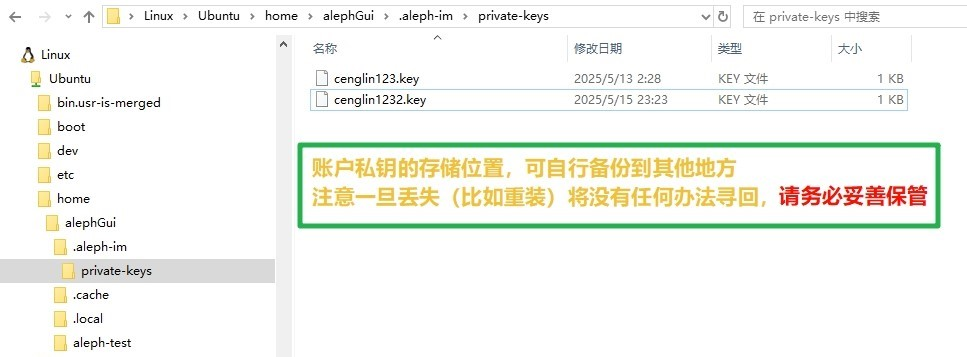

# Aleph 分享助手

<p align="center">
  
</p>

<p align="center">
  <strong>一个基于 Python 的 Aleph.im 网络文件管理图形界面工具</strong>
</p>


<p align="center">
  <a href="https://github.com/cenglin123/aleph-managerGUI/releases/latest">
    
  </a> | 作者: 层林尽染
</p>


---

##  1. 功能特点 📋

- **账户管理**
  - 创建新的 Aleph.im 账户
  - 切换活跃账户
  - 删除不需要的账户
  - 实时刷新账户列表
  - 显示账户文件详情（JSON 格式）

- **CID 操作**
  - 批量 Pin CID 到 Aleph 网络
  - 支持 CID v0 (`Qm`开头) 和 CID v1 (`bafy`开头) 格式
  - 自动转换 CID v1 到 v0 格式
  - 批量删除文件（支持按 CID 或 item_hash）
  - 智能识别输入类型（CID/item_hash）

- **用户友好界面**
  - 简洁直观的图形界面
  - 实时操作日志显示
  - 支持剪贴板粘贴
  - 操作状态实时反馈
  - 支持多行批量输入


## 2. 快速开始 🚀

### 系统要求

- Windows 10/11 (需要支持 WSL2)
- Python 3.7+ (如果从源码运行的话)
- WSL2 + Ubuntu
- IPFS Desktop 或 IPFS 守护进程（可选，如果不需要转换 CID 也可以不用）

### 安装步骤

#### 方式一：使用自动安装向导（推荐）

1. **下载项目文件**
   
   ```bash
   git clone https://github.com/cenglin123/aleph-managerGUI.git
   cd aleph-managerGUI
   ```
   
2. **运行安装向导**
   
   - 右键 `aleph_install_guide.bat`，选择"以管理员身份运行"
   - 根据提示选择安装模式：
     - `[1] 完整安装` - 全新安装 WSL、Ubuntu 和 Aleph.im （如果之前没有安装过 `wsl` 需要重启电脑，重启后再次执行此模式）
     - `[2] 保留安装` - 在现有 Ubuntu 上安装 Aleph.im
     - `[3] 卸载程序` - 卸载 WSL（慎用）
   
3. **初始化 Aleph**
   - 安装完成后会自动运行初始化脚本
   - 如果没有自动初始化，也可以手动运行 `assets/aleph_init.bat` 以完成初始化

#### 方式二：手动安装

1. **安装 WSL2 和 Ubuntu**
   
   ```powershell
   # 启用 WSL
   wsl --install
   
   # 安装 Ubuntu
   wsl --install -d Ubuntu
   ```
   
2. **在 Ubuntu 中安装 Aleph.im**
   
   ```bash
   # 更新系统
   sudo apt update && sudo apt upgrade -y
   
   # 安装 Python 和 pip
   sudo apt-get install -y python3-pip libsecp256k1-dev
   sudo apt install pipx
   pipx ensurepath
   
   # 安装 aleph-client（此过程需要耐心等待）
   pip3 install aleph-client
   ```
   
3. **安装 IPFS**
   
   - 下载并安装 [IPFS Desktop](https://docs.ipfs.tech/install/ipfs-desktop/)
   - 或使用命令行版本 IPFS
   
4. **运行程序**
   
   - 方式一：运行打包好的 exe 文件（在 [release](https://github.com/cenglin123/aleph-managerGUI/releases/latest) 中可以找到）
   - 方式二：使用 Python 运行源码
     ```bash
     python aleph_managerGUI.py
     ```

5. **其他可用指令**

    ```bash
    # 列出所有 wsl 版本
    wsl --list --verbose
    
    # 卸载旧版本
    wsl --unregister Ubuntu
    
    # 检查 aleph 安装情况
    which aleph
    ```


## 3.使用指南 📖

### 账户管理

1. **创建账户**
   - 在"创建新账户"输入框中输入账户名
   - 点击【创建】按钮
   - 系统会自动生成私钥并配置为默认账户

2. **切换账户**
   - 从下拉列表选择要切换的账户
   - 点击"切换账户"按钮
   - 系统会更新默认配置

3. **查看文件列表**
   - 点击"显示账户文件"查看当前账户的所有文件
   - 信息包括文件哈希、大小、类型、创建时间等

### CID 操作

1. **Pin 文件**
   - 在文本框中输入 CID（支持多行批量输入）
   - 支持格式：
     - CID v0: `QmXxxxx...`（46字符）
     - CID v1: `bafyxxxx...`（会自动转换）
   - 点击【PIN】按钮开始上传
   - 成功的 CID 会自动从输入框移除

2. **删除文件**
   - 输入要删除的 CID 或 item_hash
   - 点击"删除"按钮
   - 如果一个 CID 对应多个文件，会弹出选择对话框

### 快捷操作

- **粘贴**: 从剪贴板粘贴 CID
- **清空**: 清空输入框内容
- **关于IPFS↗**: 打开本地 IPFS Gateway


## 4. 配置说明 🔧

### 文件结构
```
aleph-managerGUI/
├── aleph_managerGUI.py                # 主程序
├── aleph_install_guide.bat            # 安装向导
├── assets/                            # 资源文件
│   ├── aleph_managerGUI.ico           # 程序图标
│   ├── aleph_init.bat                 # 初始化脚本
│   ├── Install-AlephWSL.ps1           # 完整安装脚本
│   ├── Install-AlephWSL-Preserve.ps1     # 保留安装脚本
│   └── Uninstall-WSL.ps1                 # 卸载脚本
└── tools/                             # 工具目录
    └── aleph.bat                         # Aleph 命令包装器（自动生成）
```

### 故障排除

1. **"找不到 aleph.bat 文件"**
   - 运行 `assets/aleph_init.bat` 进行初始化
   - 确保 WSL 和 Aleph 已正确安装

2. **"IPFS 未启动"错误**
   - 确保 IPFS Desktop 正在运行
   - 或在终端运行 `ipfs daemon`

3. **CID 转换失败**
   - 确保 IPFS 守护进程正在运行
   - 检查 CID 格式是否正确

4. **WSL 相关问题**
   - 确保 Windows 版本支持 WSL2
   - 运行 `wsl --status` 检查 WSL 状态
   - 尝试重启 WSL，在终端中运行: `wsl --shutdown`


## 5. 安全说明 🛡️

- 账户的私钥存储在 `wsl` 的 `.aleph-im/private-keys/` 目录，如下图所示。
- 请妥善备份您的私钥文件，私钥一旦丢失将没有任何办法寻回，不要分享你的私钥给任何人。

<p align="center">
  
</p>


## 6. 更新日志 📝

### v1.0.5
- 首次发布


## 贡献 🤝

欢迎提交 Issue 和 Pull Request！

## License 📄 

本项目采用 [MIT License](LICENSE) 开源许可证。

## 相关链接 🔗 

- [防炸教程：如何安全分享资源？](https://github.com/cenglin123/SteganographierGUI/wiki/%E9%98%B2%E7%82%B8%E6%95%99%E7%A8%8B%EF%BC%9A%E5%A6%82%E4%BD%95%E5%AE%89%E5%85%A8%E5%88%86%E4%BA%AB%E8%B5%84%E6%BA%90%EF%BC%9F)
- [Aleph.im 官网](https://aleph.im/)
- [IPFS 官网](https://ipfs.io/)
- [WSL 文档](https://docs.microsoft.com/windows/wsl/)

## 作者 👨‍💻 

**[层林尽染](https://github.com/cenglin123)**

---

<p align="center">
  如果这个项目对您有帮助，请给个 ⭐️ Star！
</p>