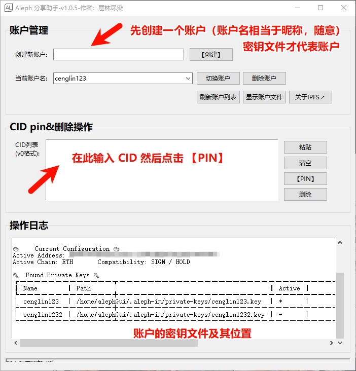
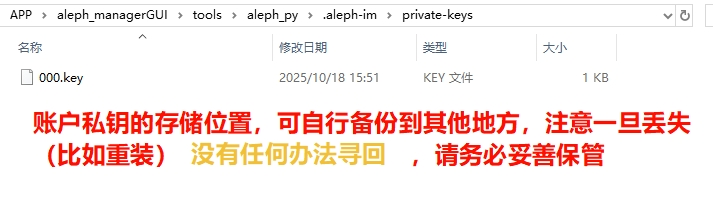

# Aleph 分享助手

<p align="center">
  
</p>

<p align="center">
  <strong>一个基于 Python 的 Aleph.im 网络文件管理图形界面工具</strong>
</p>


<p align="center">
  <a href="https://github.com/cenglin123/aleph-managerGUI">项目主页</a> |
  <a href="https://github.com/cenglin123/aleph-managerGUI/releases/latest">最新版本下载</a> |
  作者：层林尽染
</p>


<p align="center">
  
</p>

---

## 1. 功能特点 📋

- **账户管理**
    
    - 创建新的 Aleph.im 账户
        
    - 切换活跃账户
        
    - 删除不需要的账户
        
    - 实时刷新账户列表
        
    - 显示账户文件详情（JSON 格式）
        
- **CID 操作**
    
    - 批量 Pin CID 到 Aleph 网络
        
    - 支持 CID v0 (`Qm` 开头) 和 CID v1 (`bafy` 开头) 格式
        
    - 自动转换 CID v1 到 v0 格式
        
    - 批量删除文件（支持按 CID 或 item_hash）
        
    - 智能识别输入类型（CID / item_hash）
        
- **用户友好界面**
    
    - 简洁直观的图形界面
        
    - 实时操作日志显示
        
    - 支持剪贴板粘贴
        
    - 操作状态实时反馈
        
    - 支持多行批量输入
        

---

## 2. 快速开始 🚀

### 系统要求

- Windows 10 / 11
    
- Python 3.8+（若从源码运行）
    
- IPFS Desktop 或 IPFS 守护进程（用于 CID 转换）
    

---

### 安装步骤

#### 方式一：直接使用打包版本（推荐）

1. **下载最新版本**
    
    - 从 [Releases 页面](https://github.com/cenglin123/aleph-managerGUI/releases/latest) 下载最新的 `Aleph_ManagerGUI.zip`
        
    - 解压后即可使用。
        
2. **初始化 Aleph 环境**
    
    - 解压后的 `tools` 目录中包含 `aleph_py.exe`（Windows 版命令行客户端）
        
    - 程序首次运行时会提示初始化，引导创建默认账户，账户的密钥存储于程序路径 `.\tools\alpeh_py\.aleph-im\private-keys\` 
        
3. **启动程序**
    
    - 直接运行 `aleph_managerGUI.exe`
        
    - 或从命令行运行：
        
        ```powershell
        .\aleph_managerGUI.exe
        ```
        

---

#### 方式二：安装包安装

（待开发）

---

### 可选：IPFS 支持

- 下载并安装 [IPFS Desktop](https://docs.ipfs.tech/install/ipfs-desktop/)，或者 [IPFS 分享助手](https://github.com/cenglin123/IPFS-ShareAssistant)。
    
- 上述程序启动后会在后台运行 IPFS 节点
    
- Aleph 分享助手可自动检测并使用本地 IPFS 节点来转换 CID
    

---

## 3. 使用指南 📖

### 账户管理

1. **创建账户**
    
    - 在“创建新账户”输入框中输入账户名
        
    - 点击【创建】按钮
        
    - 程序会生成私钥文件并配置为默认账户，账户密钥默认路径 `.\tools\alpeh_py\.aleph-im\private-keys\` 
        
2. **切换账户**
    
    - 从下拉列表中选择目标账户
        
    - 点击“切换账户”即可更新默认配置
        
3. **查看账户文件**
    
    - 点击“显示账户文件”查看当前账户的全部文件
        
    - 显示文件哈希、大小、类型、创建时间等信息
        

---

### CID 操作

1. **Pin 文件**
    
    - 在输入框中输入 CID（可多行输入）
        
    - 支持格式：
        
        - CID v0：`Qm...`
            
        - CID v1：`bafybei...`（如果输入 v0 格式，程序会自动转换）
            
    - 点击【PIN】按钮开始上传
        
2. **删除文件**
    
    - 输入要删除的 CID 或 item_hash
        
    - 点击【删除】
        
    - 若同一个 CID 对应多个文件，会弹出选择框
        

---

### 快捷操作

- **粘贴**：支持从剪贴板粘贴 CID
    
- **清空**：清空输入框
    
- **关于 IPFS ↗**：打开本地 IPFS 网关
    

---

## 4. 文件结构 🔧

```
aleph-managerGUI/
├── aleph_managerGUI.exe          # 图形界面程序
├── assets/                       # 资源文件
│   ├── aleph_managerGUI.ico      # 程序图标
└── tools/                        # 工具目录
    ├── aleph_py/                 # Aleph 命令行客户端目录
    │   └── aleph_py.exe          # Windows 版 Aleph 命令行客户端
    └── private-keys/             # 私钥存储目录
```

---

## 5. 故障排除 ⚙️

1. **找不到 `aleph_py.exe`**
    
    - 确保 `tools/` 目录存在且包含 `aleph_py.exe`
        
    - 若缺失，可重新下载 Release 包或运行初始化脚本
        
2. **IPFS 未启动**
    
    - 确保 IPFS Desktop 正在运行
        
    - 或手动启动：
        
        ```bash
        ipfs daemon
        ```
        
3. **CID 转换失败**
    
    - 检查 CID 格式是否正确
        
    - 确认 IPFS 节点可访问
        

---

## 6. 安全说明 🛡️

- 私钥文件存放于程序目录下的 `.aleph-im/private-keys/`
    
- 请妥善备份私钥文件，**丢失将无法恢复账户访问权限**
    
- 不要与他人分享私钥内容

<p align="center">
  
</p>

---

## 7. 更新日志 📝

### v1.0.6（当前版本）

- 移除 WSL 依赖，全面支持 Windows 原生运行
    
- 新增 `aleph_py.exe` 内置命令行客户端
    
- 优化私钥路径管理与编码兼容性
    
- 加快启动速度（使用 onedir 打包）
    

---
## 贡献 🤝

欢迎提交 Issue 和 Pull Request！

## License 📄 

本项目采用 [MIT License](LICENSE) 开源许可证。

## 相关链接 🔗 

- [防炸教程：如何安全分享资源？](https://github.com/cenglin123/SteganographierGUI/wiki/%E9%98%B2%E7%82%B8%E6%95%99%E7%A8%8B%EF%BC%9A%E5%A6%82%E4%BD%95%E5%AE%89%E5%85%A8%E5%88%86%E4%BA%AB%E8%B5%84%E6%BA%90%EF%BC%9F)
- [Aleph.im 官网](https://aleph.im/)
- [IPFS 官网](https://ipfs.io/)
- [WSL 文档](https://docs.microsoft.com/windows/wsl/)

## 作者 👨‍💻 

**[层林尽染](https://github.com/cenglin123)**

---

<p align="center">
  如果这个项目对您有帮助，请给个 ⭐️ Star！
</p>
